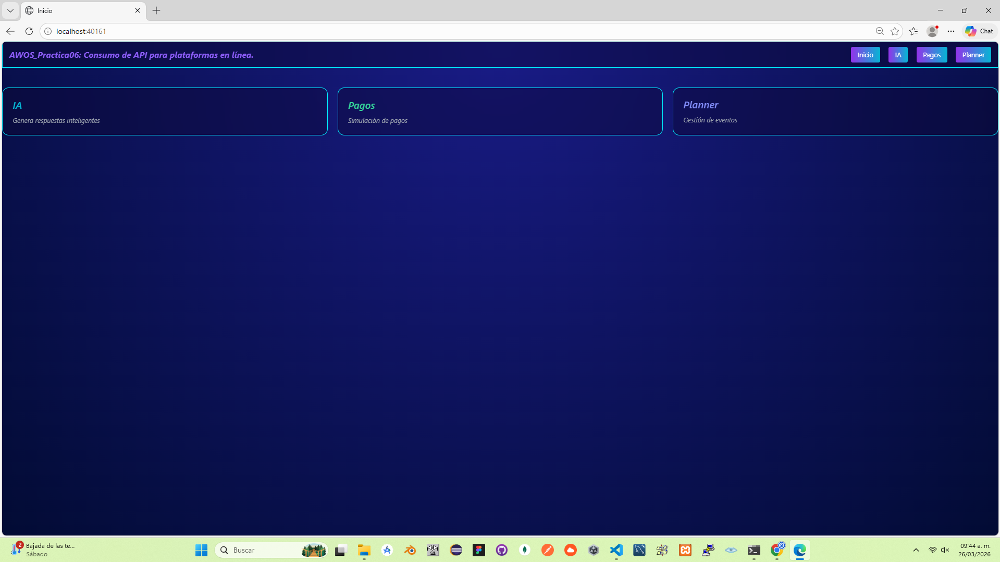
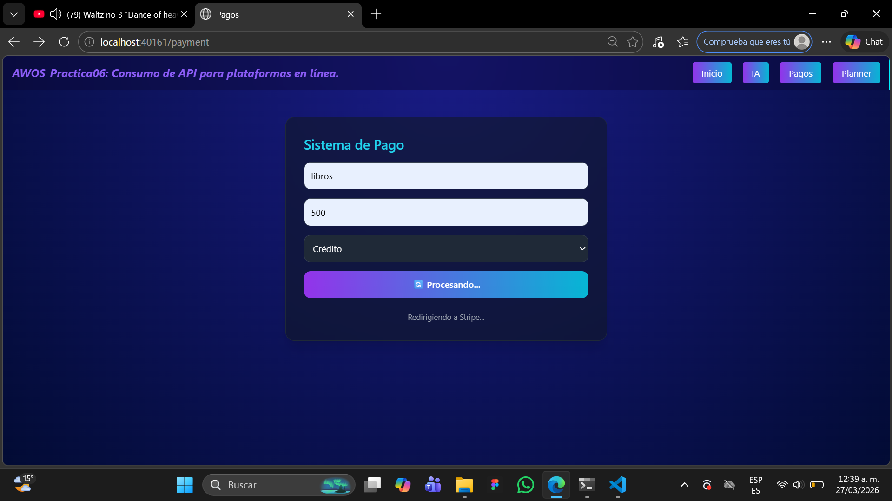
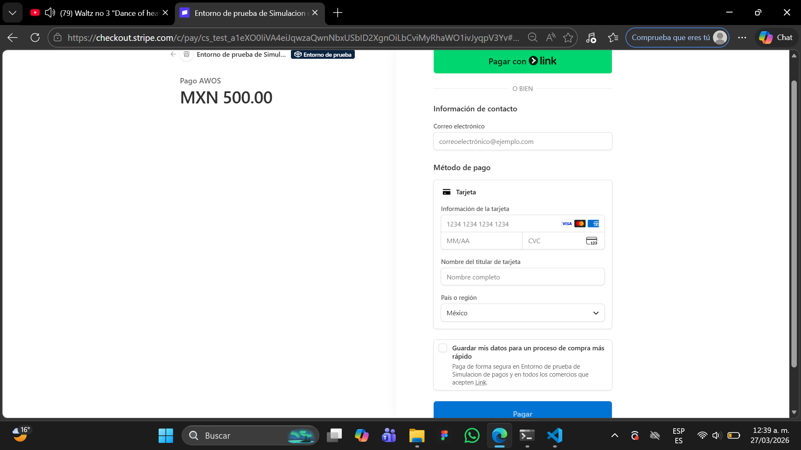
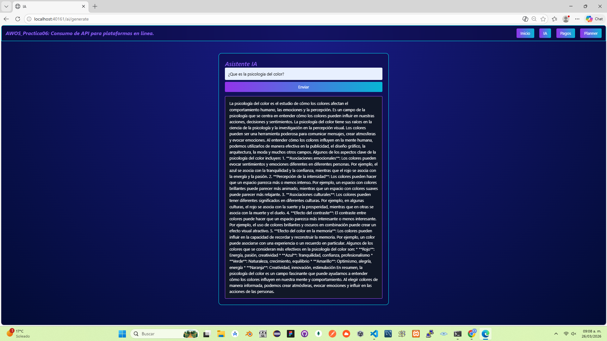
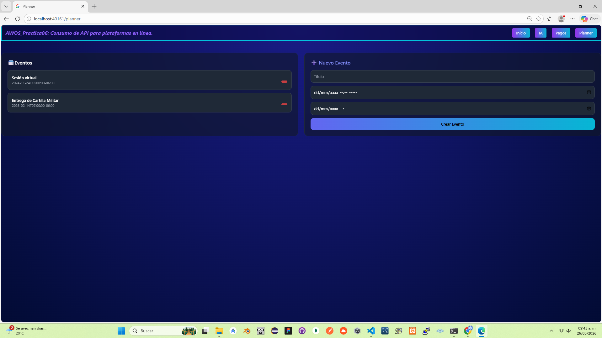
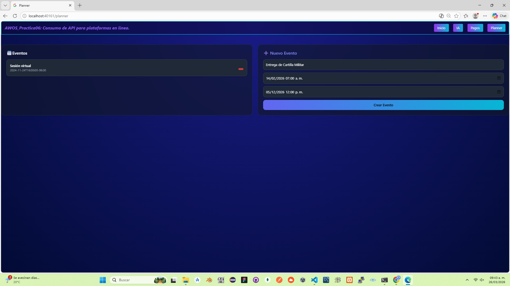

# Consumo de APIs para Plataformas Online

## El objetivo de la practica es: 

    Desarrollar una aplicación web que consuma APIs reales de:

* Pagos (Stripe)
* AI Generativa (OpenAI)
* Planeación (Google Calendar)

---

### Tecnologias a utilizar: 

* Node.js + express
* Tailwind CSS 3.x (UI Moderna)
* Passport.js (OAuth)
* Stripe API
* OpenAI API
* Google Calendar API

---

### Funcionalidades de cada API

* Simulación de pagos con Stripe
* Generación de texto con IA
* Consultar y crear eventos en Google Calendar
* Autenticación con Google
* Interfaz Moderna

---

## Estructura de la Practica: 

>|- **config**  
> &nbsp;&nbsp; |__ openia.js  
> &nbsp;&nbsp; |__ passport.js  
>|- **controllers**  
> &nbsp;&nbsp; |__ aiController.js  
> &nbsp;&nbsp; |__ paymentController.js  
> &nbsp;&nbsp; |__ plannerController.js  
>|- **node_modules**  
> &nbsp;&nbsp; |__ Tiene varias carpetas  
>|- **public**  
> &nbsp;&nbsp; |_ **css**  
> &nbsp;&nbsp;&nbsp;&nbsp; |__ input.css  
> &nbsp;&nbsp;&nbsp;&nbsp; |__ output.css  
> &nbsp;&nbsp; |_ **img**  
> &nbsp;&nbsp;&nbsp;&nbsp; |__ PantallaInicio.png  
> &nbsp;&nbsp;&nbsp;&nbsp; |__ Prueba01.png  
> &nbsp;&nbsp;&nbsp;&nbsp; |__ Prueba02.png  
> &nbsp;&nbsp;&nbsp;&nbsp; |__ Prueba03.png  
> &nbsp;&nbsp;&nbsp;&nbsp; |__ Prueba04.png  
> &nbsp;&nbsp;&nbsp;&nbsp; |__ Prueba05.png  
>|- **routes**  
> &nbsp;&nbsp; |_ aiRoutes.js  
> &nbsp;&nbsp; |_ paymentRoutes.js  
> &nbsp;&nbsp; |_ plannerRoutes.js  
>|- **services**  
> &nbsp;&nbsp; |_ googleService.js  
>|-**views**  
> &nbsp;&nbsp; |_ **partials**  
> &nbsp;&nbsp;&nbsp;&nbsp; |__ footer.ejs  
> &nbsp;&nbsp;&nbsp;&nbsp; |__ header.ejs  
> &nbsp;&nbsp; |__ ai.ejs  
> &nbsp;&nbsp; |__ index.ejs  
> &nbsp;&nbsp; |__ payment.ejs  
> &nbsp;&nbsp; |__ planner.ejs  
>|- **.env**  
>|- **.gitignore**  
>|- **app.js**  
>|- **package-lock.json**  
>|- **package.json**  
>|- **postcss.config.js**  
>|- **Readme.md**  
>|- **tailwind.config.js**  

# Endpoints

## Stripe (20)

| # | Endpoint | Método |
|--|--------|--------|
| 1 | /v1/checkout/sessions | POST |
| 2 | /v1/payment_intents | POST |
| 3 | /v1/payment_intents/:id | GET |
| 4 | /v1/payment_intents/:id/confirm | POST |
| 5 | /v1/payment_intents/:id/cancel | POST |
| 6 | /v1/customers | POST |
| 7 | /v1/customers/:id | GET |
| 8 | /v1/customers/:id | DELETE |
| 9 | /v1/refunds | POST |
| 10 | /v1/refunds/:id | GET |
| 11 | /v1/products | GET |
| 12 | /v1/products | POST |
| 13 | /v1/prices | POST |
| 14 | /v1/prices/:id | GET |
| 15 | /v1/charges | POST |
| 16 | /v1/charges/:id | GET |
| 17 | /v1/payment_methods | GET |
| 18 | /v1/payment_methods/:id | GET |
| 19 | /v1/setup_intents | POST |
| 20 | /v1/balance | GET |

---

## OpenAI (20)

| # | Endpoint | Método |
|--|--------|--------|
| 1 | /v1/responses | POST |
| 2 | /v1/models | GET |
| 3 | /v1/models/:id | GET |
| 4 | /v1/embeddings | POST |
| 5 | /v1/images | POST |
| 6 | /v1/files | GET |
| 7 | /v1/files | POST |
| 8 | /v1/files/:id | DELETE |
| 9 | /v1/fine_tuning/jobs | POST |
| 10 | /v1/fine_tuning/jobs | GET |
| 11 | /v1/fine_tuning/jobs/:id | GET |
| 12 | /v1/audio/transcriptions | POST |
| 13 | /v1/audio/speech | POST |
| 14 | /v1/batches | POST |
| 15 | /v1/batches/:id | GET |
| 16 | /v1/vector_stores | POST |
| 17 | /v1/vector_stores/:id | GET |
| 18 | /v1/assistants | POST |
| 19 | /v1/assistants/:id | GET |
| 20 | /v1/threads | POST |

---

## Google Calendar (20)

| # | Endpoint | Método |
|--|--------|--------|
| 1 | /calendar/v3/calendars | GET |
| 2 | /calendar/v3/users/me/calendarList | GET |
| 3 | /calendar/v3/calendars/:id | GET |
| 4 | /calendar/v3/calendars/:id | PUT |
| 5 | /calendar/v3/events | GET |
| 6 | /calendar/v3/events | POST |
| 7 | /calendar/v3/events/:id | GET |
| 8 | /calendar/v3/events/:id | PUT |
| 9 | /calendar/v3/events/:id | DELETE |
| 10 | /calendar/v3/events/instances | GET |
| 11 | /calendar/v3/freeBusy | POST |
| 12 | /calendar/v3/colors | GET |
| 13 | /calendar/v3/settings | GET |
| 14 | /calendar/v3/settings/:id | GET |
| 15 | /calendar/v3/acl | GET |
| 16 | /calendar/v3/acl/:id | GET |
| 17 | /calendar/v3/events/watch | POST |
| 18 | /calendar/v3/calendars/watch | POST |
| 19 | /calendar/v3/events/move | POST |
| 20 | /calendar/v3/channels/stop | POST |

---

# Pruebas del sistema

## Prueba 1: Vista Principal

Esta es la pantalla principal en donde hay diferentes plataformas en linea.

## Prueba 2: Pago con Stripe

Estas son las pantallas en donde se hizo la simulacion de un pago en linea.

- En esta parte tuve complicacion (⚠️ Un error) en una linea en la que no me llevava a la segunda prueba.

* Esta es la *Prueba1*

* Esta es la *Prueba2*

## Prueba 3: AI

Estas es la pantalla de una Inteligencia Artificial gratis en linea.

* Esta es la *Prueba3*

## Prueba 4: Google Calendar

Estas es la pantalla en donde se puede realizar la creacion de eventos y agregarle tanto la fecha y hora de inicio como la fecha y hora final.

* Esta es la *Prueba4*

* Esta es la *Prueba5*

---

# Fases del Proyecto

| Ramas | Descripción | Estatus |
|------|------------|--------|
| *1* | Configuración inicial (Node + Express) | ✅ Terminado |
| *2* | Configuración Tailwind (UI Moderna) | ✅ Terminado |
| *3* | Middlewares y servidor | ✅ Terminado |
| *4* | Integración APIs (Stripe, IA, Google) | ✅ Terminado |
| *5* | Desarrollo de vistas | ✅ Terminado |
| *6* | Sistema de autenticación | ✅ Terminado |
| *7* | Integración completa | ✅ Terminado |
| *8* | Pruebas y documentación | ✅ Terminado |
